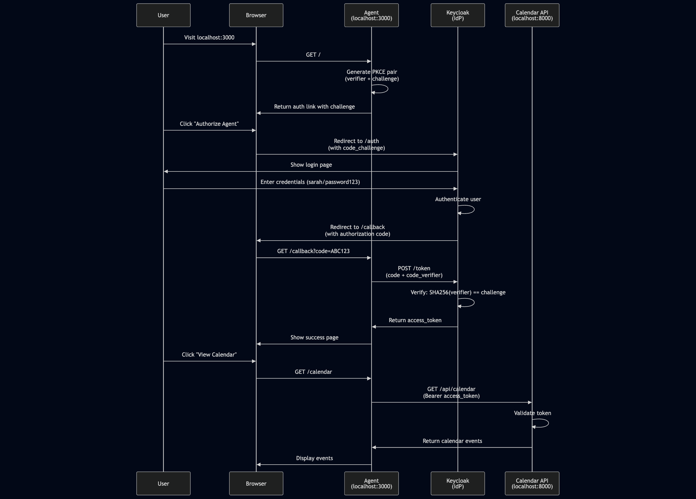

# Project 1: OAuth 2.1 + PKCE Implementation for AI Agents

**Part of: AI Agent Identity & Access Management Learning Series (1/15)**

Based on ["Identity Management for Agentic AI"](https://openid.net/) white paper by OpenID Foundation (October 2025)

---

## Overview

This project implements the OAuth 2.1 authorization code flow with PKCE (Proof Key for Code Exchange) for a simple AI agent accessing protected resources on behalf of a user. It demonstrates the foundational security pattern for delegated authorization in agentic systems.

## Learning Objectives

- Understand OAuth 2.1 authorization code flow
- Implement PKCE to prevent authorization code interception attacks
- Establish two-layer authentication (user + client)
- Create basic AI agent that accesses protected resources with delegated authority

## Architecture
User → Agent (FastAPI) → Keycloak (IdP) → Resource API (Calendar) ↓ ↓ PKCE Challenge Authorization Code ↓ ↓ PKCE Verifier Access Token

## Prerequisites

- Python 3.12+
- Docker & Docker Compose
- Keycloak 23.0

## Project Structure

```
project1-oauth-agent/
├── agent.py              # OAuth client with PKCE implementation
├── config.py             # Keycloak configuration
├── resource_api.py       # Protected calendar API
├── requirements.txt      # Python dependencies
├── docker-compose.yml    # Keycloak container
├── sarah.png            # OAuth flow diagram
├── TODO.md              # Deep-dive learning items
└── README.md            # This file
```

## Setup

### 1. Create Virtual Environment
python3.12 -m venv project1 source project1/bin/activate # On Windows: project1\Scripts\activate pip install -r requirements.txt

### 2. Start Keycloak
docker compose up -d

Access Keycloak admin console at `http://localhost:8080` (admin/admin)

### 3. Configure Keycloak

**Create Realm:**
- Name: `agent-demo`

**Create User:**
- Username: `sarah`
- Email: `sarah@example.com`
- Password: `password123` (non-temporary)

**Create Client:**
- Client ID: `ai-agent-client`
- Client type: OpenID Connect
- Authentication flow: Standard flow enabled
- Valid redirect URI: `http://localhost:3000/callback`

## Running the Application

### Terminal 1 - Resource API
python resource_api.py

Runs on `http://localhost:8000`

### Terminal 2 - Agent
python agent.py

Runs on `http://localhost:3000`

### Test the Flow

1. Open `http://localhost:3000`
2. Click "Authorize Agent"
3. Log in as sarah/password123
4. View calendar events

## OAuth 2.1 + PKCE Flow

1. **Generate PKCE Pair**: Agent creates `code_verifier` (random) and `code_challenge` (SHA256 hash)
2. **Authorization Request**: Agent redirects user to Keycloak with `code_challenge`
3. **User Authentication**: User logs in and approves access
4. **Authorization Code**: Keycloak redirects back with temporary `code`
5. **Token Exchange**: Agent sends `code` + `code_verifier` to prove identity
6. **Access Token**: Keycloak validates and issues `access_token`
7. **API Access**: Agent calls protected resource with token

## Key Security Mechanisms

### PKCE (RFC 7636)
Prevents authorization code interception attacks by cryptographically binding the token request to the authorization request.

**Without PKCE:** Attacker intercepts code → exchanges for token
**With PKCE:** Attacker has code but not verifier → token exchange fails

### Two-Layer Authentication
1. **User Authentication**: Human approves via Keycloak login
2. **Client Authentication**: Agent proves identity via PKCE verifier

## Standards Implemented

- **OAuth 2.1** - Modern authorization framework
- **PKCE (RFC 7636)** - Code exchange security
- **Authorization Code Flow** - Secure delegation pattern

## Related Themes

From "Identity Management for Agentic AI" white paper:

- **Theme #2**: Two-Layer Authentication Challenge
- **Theme #3**: OAuth 2.1 with PKCE as Foundation
- **Theme #19**: Externalized Authorization Architecture

## How It Works



### Step-by-Step Flow

#### 1. **Initiate Authorization**
User visits `http://localhost:3000` and clicks "Authorize Agent"
- Agent generates random `code_verifier` (43+ characters)
- Computes `code_challenge` = BASE64URL(SHA256(code_verifier))
- Redirects user to Keycloak with challenge

#### 2. **User Authentication**
User is redirected to Keycloak login page
- Enters credentials: sarah/password123
- Keycloak authenticates the user
- User approves agent access to resources

#### 3. **Authorization Code Issued**
Keycloak redirects back to agent with authorization code
- URL: `http://localhost:3000/callback?code=ABC123...`
- Code is single-use and expires in ~60 seconds
- Code is bound to the PKCE challenge

#### 4. **Token Exchange (PKCE Verification)**
Agent exchanges code for access token
- Sends: authorization code + code_verifier
- Keycloak validates: SHA256(code_verifier) == code_challenge
- If match: issues access_token
- If mismatch: rejects (prevents code interception attack)

#### 5. **Access Protected Resource**
Agent uses access_token to call Calendar API
- Includes: `Authorization: Bearer eyJhbG...`
- Calendar API validates token
- Returns protected data (calendar events)

### Security Highlights

**PKCE Protection:**
- Even if attacker intercepts authorization code, they cannot exchange it for a token without the `code_verifier`
- The verifier never travels through the browser (stored server-side)

**Two-Layer Auth:**
- **Layer 1**: User proves identity to Keycloak
- **Layer 2**: Agent proves it's the same client via PKCE

**Token Scope:**
- Access token is scoped to specific permissions
- Cannot be used for actions beyond approved scope

## Next Steps

**Project 2**: Add OpenID Connect (OIDC) for user identity layer

## Deep Dive Topics

See `TODO.md` for concepts requiring deeper understanding:
- PKCE security mechanism internals
- JWT token structure and validation
- Token lifecycle management
- Authorization vs Authentication distinction

## Technologies

- **Python 3.12** - Implementation language
- **FastAPI** - Web framework for agent and resource API
- **Authlib** - OAuth/OIDC library
- **Keycloak 23.0** - Identity Provider (IdP)
- **Docker** - Container runtime

## References

- [OAuth 2.1 Specification](https://oauth.net/2.1/)
- [RFC 7636 - PKCE](https://datatracker.ietf.org/doc/html/rfc7636)
- [Identity Management for Agentic AI](https://openid.net/) (OpenID Foundation, 2025)
- [Keycloak Documentation](https://www.keycloak.org/documentation)

## Author

Part of self-directed learning path for AI Agent Identity & Access Management

**Series Progress**: 1/15 projects completed

---

*This project is for educational purposes, demonstrating OAuth 2.1 + PKCE fundamentals for agentic AI systems.*
