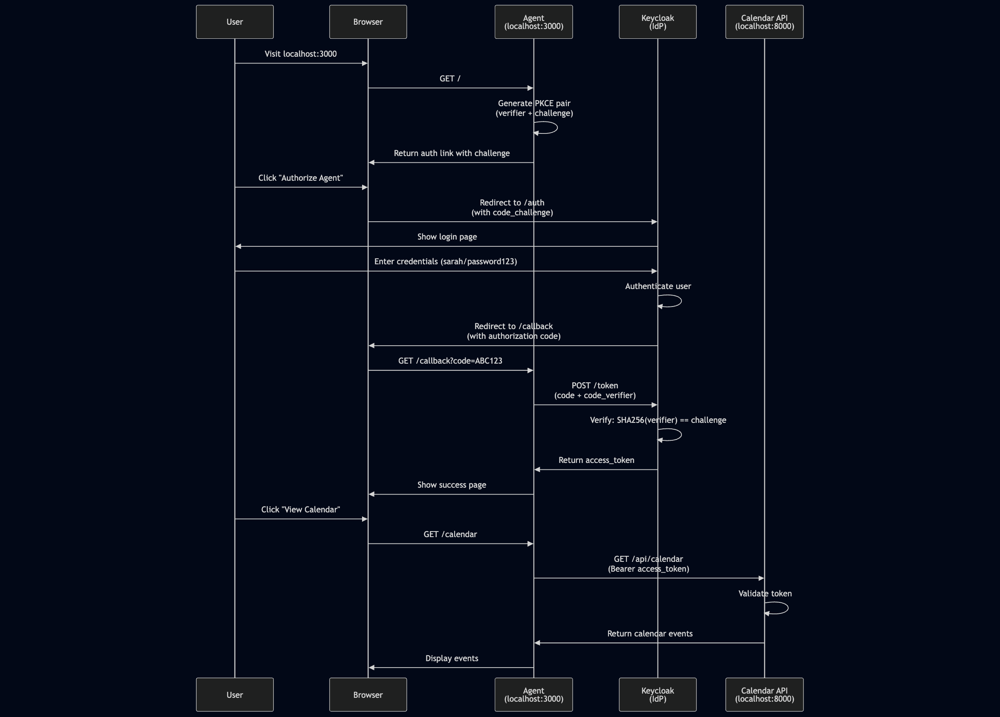

# Project 1 & 2: OAuth 2.1 + PKCE + OpenID Connect for AI Agents

**Part of: AI Agent Identity & Access Management Learning Series (1-2/15)**

Based on ["Identity Management for Agentic AI"](https://openid.net/) white paper by OpenID Foundation (October 2025)

---

## Overview

This project implements the OAuth 2.1 authorization code flow with PKCE (Proof Key for Code Exchange) and OpenID Connect (OIDC) for an AI agent accessing protected resources on behalf of a user. It demonstrates the foundational security pattern for delegated authorization AND authentication in agentic systems.

## Learning Objectives

**Project 1 (OAuth 2.1 + PKCE):**
- Understand OAuth 2.1 authorization code flow
- Implement PKCE to prevent authorization code interception attacks
- Establish two-layer authentication (user + client)
- Create basic AI agent that accesses protected resources with delegated authority

**Project 2 (OpenID Connect):**
- Add identity layer on top of OAuth 2.1
- Understand difference between authorization (OAuth) and authentication (OIDC)
- Decode and validate ID tokens
- Implement personalized user experience with identity claims
- Create comprehensive audit trails with user identity

## Architecture
User → Agent (FastAPI) → Keycloak (IdP) → Resource API (Calendar) ↓ ↓ PKCE Challenge Authorization Code ↓ ↓ PKCE Verifier Access Token + ID Token

## Prerequisites

- Python 3.12+
- Docker & Docker Compose
- Keycloak 23.0

## Project Structure
```
project1-oauth-agent/ ├── agent.py # OAuth + OIDC client with PKCE implementation ├── config.py # Keycloak configuration ├── resource_api.py # Protected calendar API ├── audit_log.py # Audit logging with user identity ├── requirements.txt # Python dependencies ├── docker-compose.yml # Keycloak container ├── audit.log # Generated audit trail ├── sarah.png # OAuth flow diagram ├── TODO.md # Deep-dive learning items └── README.md # This file
```
## Setup

### 1. Create Virtual Environment
python3.12 -m venv project1 source project1/bin/activate # On Windows: project1\Scripts\activate pip install -r requirements.txt

### 2. Start Keycloak
docker compose up -d

Access Keycloak admin console at `http://localhost:8080` (admin/admin)

### 3. Configure Keycloak

**Create Realm:**
- Name: `agent-demo`

**Create User:**
- Username: `sarah`
- Email: `sarah@example.com`
- First name: `Sarah`
- Last name: `Smith`
- Password: `password123` (non-temporary)

**Create Client:**
- Client ID: `ai-agent-client`
- Client type: OpenID Connect
- Authentication flow: Standard flow enabled
- Valid redirect URI: `http://localhost:3000/callback`

## Running the Application

### Terminal 1 - Resource API
python resource_api.py

Runs on `http://localhost:8000`

### Terminal 2 - Agent
python agent.py

Runs on `http://localhost:3000`

### Test the Flow

1. Open `http://localhost:3000`
2. Click "Authorize Agent"
3. Log in as sarah/password123
4. View personalized calendar: "Hi Sarah Smith!, here are your Calendar"
5. Check `/token-info` to see ID token claims
6. Check `/compare-tokens` to see OAuth vs OIDC differences
7. Review `audit.log` for user activity trail

## Available Endpoints

- `/` - Home page with authorization link
- `/callback` - OAuth callback handler
- `/calendar` - View calendar with personalized greeting
- `/token-info` - Display decoded ID token claims
- `/compare-tokens` - Side-by-side comparison of access_token vs id_token

## OAuth 2.1 + PKCE + OIDC Flow

1. **Generate PKCE Pair**: Agent creates `code_verifier` (random) and `code_challenge` (SHA256 hash)
2. **Authorization Request**: Agent redirects user to Keycloak with `code_challenge` and scopes: `openid profile email`
3. **User Authentication**: User logs in and approves access
4. **Authorization Code**: Keycloak redirects back with temporary `code`
5. **Token Exchange**: Agent sends `code` + `code_verifier` to prove identity
6. **Dual Tokens**: Keycloak validates and issues BOTH `access_token` AND `id_token`
7. **API Access**: Agent calls protected resource with access_token
8. **Identity Usage**: Agent uses id_token to personalize UX and audit logging

## Key Security Mechanisms

### PKCE (RFC 7636)
Prevents authorization code interception attacks by cryptographically binding the token request to the authorization request.

**Without PKCE:** Attacker intercepts code → exchanges for token  
**With PKCE:** Attacker has code but not verifier → token exchange fails

### Two-Layer Authentication
1. **User Authentication**: Human approves via Keycloak login
2. **Client Authentication**: Agent proves identity via PKCE verifier

### Dual Token Model
1. **Access Token**: Authorization - what the agent can DO (call APIs)
2. **ID Token**: Authentication - who the user IS (identity claims)

## Token Comparison

### Access Token (OAuth 2.1)
**Purpose:** Authorization - permissions and scopes  
**Used for:** Calling protected APIs  
**Contains:**
- `scope`: Granted permissions
- `realm_access`: Roles
- `allowed-origins`: CORS settings
- Expiration time

**Sent to:** Resource servers (Calendar API)

### ID Token (OIDC)
**Purpose:** Authentication - user identity  
**Used for:** Knowing who the user is  
**Contains:**
- `sub`: Unique user identifier
- `email`: User's email address
- `name`: Full name
- `given_name`, `family_name`: Name components
- `preferred_username`: Username

**Sent to:** Your application only (never to external APIs)

## Audit Logging

The system logs all user actions with complete identity information:
[2025-10-25 13:57:44] User: sarah@example.com (Sarah Smith) | Action: authorized_agent | Agent: ai-agent-client [2025-10-25 13:58:16] User: sarah@example.com (Sarah Smith) | Action: accessed_calendar | Agent: ai-agent-client

**Benefits:**
- Complete accountability (WHO did WHAT and WHEN)
- Prevents agent impersonation issues
- Compliance with audit requirements
- Security incident investigation

## Standards Implemented

- **OAuth 2.1** - Modern authorization framework
- **PKCE (RFC 7636)** - Code exchange security
- **OpenID Connect (OIDC)** - Identity layer on OAuth 2.0
- **JWT (JSON Web Tokens)** - Token format
- **Authorization Code Flow** - Secure delegation pattern

## Related Themes

From "Identity Management for Agentic AI" white paper:

- **Theme #2**: Two-Layer Authentication Challenge
- **Theme #3**: OAuth 2.1 with PKCE as Foundation
- **Theme #9**: Delegated Authority vs User Impersonation
- **Theme #18**: Closing the Auditability Gap
- **Theme #19**: Externalized Authorization Architecture

## How It Works



### Step-by-Step Flow

#### 1. **Initiate Authorization**
User visits `http://localhost:3000` and clicks "Authorize Agent"
- Agent generates random `code_verifier` (43+ characters)
- Computes `code_challenge` = BASE64URL(SHA256(code_verifier))
- Redirects user to Keycloak with challenge and scopes: `openid profile email`

#### 2. **User Authentication**
User is redirected to Keycloak login page
- Enters credentials: sarah/password123
- Keycloak authenticates the user
- User approves agent access to resources

#### 3. **Authorization Code Issued**
Keycloak redirects back to agent with authorization code
- URL: `http://localhost:3000/callback?code=ABC123...`
- Code is single-use and expires in ~60 seconds
- Code is bound to the PKCE challenge

#### 4. **Token Exchange (PKCE Verification)**
Agent exchanges code for tokens
- Sends: authorization code + code_verifier
- Keycloak validates: SHA256(code_verifier) == code_challenge
- If match: issues BOTH access_token AND id_token
- If mismatch: rejects (prevents code interception attack)

#### 5. **Identity Extraction**
Agent decodes ID token to extract user identity
- Extracts: name, email, sub (user ID)
- Logs authorization event with user identity
- Stores both tokens for use

#### 6. **Access Protected Resource**
Agent uses access_token to call Calendar API
- Logs access attempt with user identity
- Includes: `Authorization: Bearer eyJhbG...`
- Calendar API validates token
- Returns protected data (calendar events)

#### 7. **Personalized Response**
Agent uses ID token claims to personalize response
- Displays: "Hi Sarah Smith!, here are your Calendar"
- Complete audit trail maintained

### Security Highlights

**PKCE Protection:**
- Even if attacker intercepts authorization code, they cannot exchange it for a token without the `code_verifier`
- The verifier never travels through the browser (stored server-side)

**Two-Layer Auth:**
- **Layer 1**: User proves identity to Keycloak
- **Layer 2**: Agent proves it's the same client via PKCE

**Identity Separation:**
- Access token for authorization (API calls)
- ID token for authentication (user identity)
- Never send ID token to external APIs

**Audit Trail:**
- Complete logging of WHO accessed WHAT
- Prevents accountability gaps
- Essential for security and compliance

## Next Steps

**Project 3**: Model Context Protocol (MCP) - Connecting AI agents to tools with proper authentication

## Deep Dive Topics

See `TODO.md` for concepts requiring deeper understanding:
- PKCE security mechanism internals
- JWT token structure and validation
- Token lifecycle management
- Authorization vs Authentication distinction
- OAuth vs OIDC differences
- Why dual tokens are necessary
- Audit trail best practices

## Technologies

- **Python 3.12** - Implementation language
- **FastAPI** - Web framework for agent and resource API
- **Authlib** - OAuth/OIDC library
- **PyJWT** - JWT decoding and validation
- **Keycloak 23.0** - Identity Provider (IdP)
- **Docker** - Container runtime

## References

- [OAuth 2.1 Specification](https://oauth.net/2.1/)
- [RFC 7636 - PKCE](https://datatracker.ietf.org/doc/html/rfc7636)
- [OpenID Connect Core 1.0](https://openid.net/specs/openid-connect-core-1_0.html)
- [Identity Management for Agentic AI](https://openid.net/) (OpenID Foundation, 2025)
- [Keycloak Documentation](https://www.keycloak.org/documentation)
- [JWT.io](https://jwt.io) - JWT debugging tool

## Author

Part of self-directed learning path for AI Agent Identity & Access Management

**Series Progress**: 2/15 projects completed

---

*This project is for educational purposes, demonstrating OAuth 2.1 + PKCE + OIDC fundamentals for agentic AI systems.*