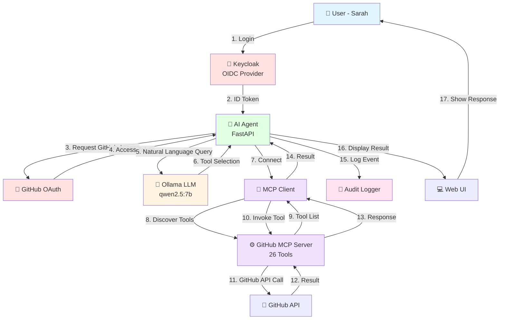

# Project 3: MCP Agent with GitHub Integration

AI Agent with Identity & Access Management, Model Context Protocol, and LLM-powered tool selection.

## 🎯 Project Overview

This project demonstrates a production-grade AI agent that:
- Authenticates users via **Keycloak (OpenID Connect)**
- Authorizes GitHub access via **OAuth 2.1**
- Discovers and executes GitHub operations via **Model Context Protocol (MCP)**
- Uses **Ollama LLM** for intelligent tool selection from natural language
- Maintains comprehensive **audit logs** for compliance

Part of a 15-project learning path on AI Agent Identity & Access Management based on OpenID Foundation's white paper.

---

## 🏗️ Architecture

**Multi-layer authentication and authorization:**

1. **User Layer**: Keycloak authenticates human users (OIDC)
2. **Tool Layer**: GitHub OAuth authorizes API access
3. **Agent Layer**: MCP client discovers and invokes 26 GitHub tools
4. **Intelligence Layer**: Ollama LLM selects appropriate tools from queries
5. **Audit Layer**: Logs all interactions for security/compliance

**Architecture Diagram:** (See Mermaid diagram below)

---

## 🔑 Key Features

### Identity & Access Management
- ✅ Dual OAuth flows (Keycloak + GitHub)
- ✅ User-specific token storage
- ✅ Secure credential management (.env)
- ✅ Token lifecycle management

### Model Context Protocol (MCP)
- ✅ Dynamic tool discovery (26 GitHub operations)
- ✅ Persistent connection architecture
- ✅ Comprehensive error handling
- ✅ Structured logging

### LLM Integration
- ✅ Natural language → tool mapping
- ✅ Automatic parameter extraction
- ✅ Local inference (Ollama qwen2.5:7b)

### Security & Compliance
- ✅ Audit logging (user, query, tool, result)
- ✅ Audit UI for visibility
- ✅ No credentials in code

---

## 📋 Prerequisites

- **Python 3.12+**
- **Node.js & npm** (for MCP server)
- **Docker** (for Keycloak)
- **Ollama** with qwen2.5:7b model
- **GitHub account** with OAuth app configured
- **Keycloak** with agent-demo realm configured

---

## 🚀 Installation

### 1. Clone Repository
```bash
git clone https://github.com/0xchamin/agent-security-and-identity.git
cd project3-mcp-github
```

### 2. Create Virtual Environment
```bash
python -m venv venv
source venv/bin/activate  # On Windows: venv\Scripts\activate
```

### 3. Install Dependencies
```bash
pip install -r requirements.txt
npm install -g @modelcontextprotocol/server-github
```

### 4. Configure Environment Variables
Create `.env` file:
```env
# Keycloak
KEYCLOAK_CLIENT_ID=ai-agent-client
KEYCLOAK_CLIENT_SECRET=your_keycloak_secret

# GitHub
GITHUB_CLIENT_ID=your_github_client_id
GITHUB_CLIENT_SECRET=your_github_client_secret
```

### 5. Start Keycloak
```bash
# From Projects 1-2 setup
docker-compose up -d
```

### 6. Start Ollama
```bash
ollama serve
ollama pull qwen2.5:7b
```

---

## 🎮 Usage

### Start the Agent
```bash
uvicorn api.main:app --reload
```

### Access the Application
1. Navigate to `http://127.0.0.1:8000/login`
2. Login with Keycloak (e.g., sarah/password123)
3. Authorize GitHub access
4. Use the chat interface at `/chat`

### Example Queries
- "search for fastapi repositories"
- "find issues in pytorch"
- "search for python machine learning projects"

### View Audit Logs
Navigate to `http://127.0.0.1:8000/audit`

---

## 📁 Project Structure

```
project3-mcp-github/
├── api/
│   ├── main.py              # FastAPI app entry
│   └── routes.py            # API endpoints
├── auth/
│   ├── github_oauth.py      # GitHub OAuth flow
│   ├── keycloak_oauth.py    # Keycloak OIDC flow
│   └── token_store.py       # Token persistence
├── mcp_client/
│   └── client.py            # MCP client wrapper
├── llm/
│   ├── ollama_client.py     # Ollama integration
│   └── agent.py             # Agent orchestration
├── audit/
│   └── logger.py            # Audit logging
├── .env                      # Environment variables (not in git)
├── tokens.json              # Token storage (not in git)
├── audit_log.json           # Audit logs (not in git)
└── requirements.txt         # Python dependencies
```

---

## 🔐 Security Considerations

**Current Implementation (POC):**
- Tokens stored in JSON file (encrypted storage recommended for production)
- In-memory OAuth state (use Redis/database for production)
- Single-user session management (implement proper sessions for production)

**Production Recommendations (Project 3.5):**
- SPIFFE/SPIRE for workload identity
- RBAC/TBAC for tool access control
- Token rotation and expiration
- Prompt injection detection
- Tool poisoning prevention

---

## 📊 Mermaid Architecture Diagram



**Diagram Description:**

The architecture diagram illustrates the complete flow of an authenticated user query through the system:

1. **Authentication Layer** (Steps 1-4): User authenticates via Keycloak, agent obtains GitHub access token
2. **Intelligence Layer** (Steps 5-6): LLM analyzes natural language and selects appropriate tool
3. **Tool Discovery** (Steps 7-9): MCP client connects to GitHub MCP server and discovers 26 available tools
4. **Execution Layer** (Steps 10-13): Selected tool is invoked, GitHub API call is made, results returned
5. **Response & Audit** (Steps 14-17): Results logged for compliance, displayed to user

The color coding represents different system layers: blue (user), red (auth providers), green (agent core), yellow (LLM), purple (MCP), pink (audit).
---

## 📝 Standards & Protocols

- **OAuth 2.1** - Authorization framework
- **OpenID Connect (OIDC)** - Identity layer
- **Model Context Protocol (MCP)** - Tool communication
- **JSON Web Tokens (JWT)** - Token format

---

## 🎓 Learning Outcomes

From this project, you learned:
- Multi-provider OAuth orchestration
- MCP protocol implementation
- LLM tool selection patterns
- Audit logging for AI agents
- Production-grade error handling
- Secure credential management

---

## 🔮 Future Enhancements (ToDo)

- [ ] **Phase 7**: Multi-turn conversations & tool chaining
- [ ] **RBAC**: Role-based access control for tools
- [ ] **User Context**: Add GitHub username to agent context
- [ ] **Session Management**: Proper user sessions with Redis
- [ ] **Token Encryption**: Encrypt tokens at rest
- [ ] **Project 3.5**: Security hardening (SPIFFE/SPIRE, tool poisoning detection)

---

## 📚 References

- [OpenID Foundation: Identity Management for Agentic AI](https://openid.net/specs/)
- [Model Context Protocol Specification](https://modelcontextprotocol.io/)
- [GitHub MCP Server](https://github.com/github/github-mcp-server)
- [Ollama Documentation](https://ollama.ai/)

---

## 👨‍💻 Author

**Chamin Lokugamage**  
Senior Software Engineer @ HPE  
PhD in Computer Science (Scalable Data Systems)

---

## 📄 License

MIT License - See LICENSE file for details

---
```
